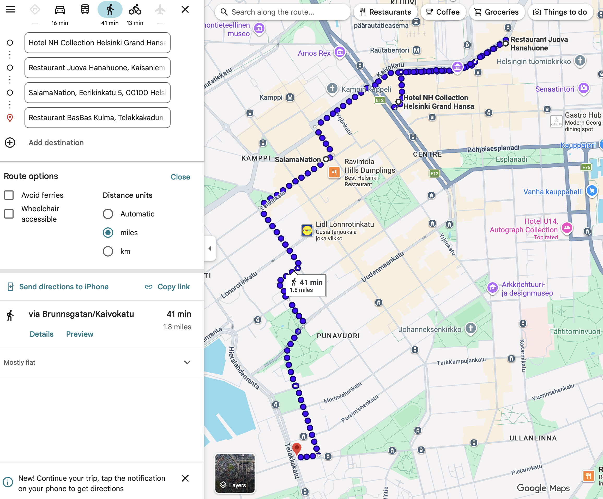

# Helsinki

🇫🇮 **June 12–16 · 4 nights**

🏨 <strong>NH Collection Helsinki Grand Hansa</strong> 
Mannerheimintie 5, 00100 Helsinki 
📞 +358 20 7120290 · Confirmation: <code>0160636817</code>

---

## Day 1 — Wed Jun 11 · Denver → Helsinki { .day-header }

!!! travel "Fly Denver → Helsinki"
    **Depart:** Denver (DEN) 10:32 AM  
    **Flights:** American AA1756 → AA9018 · Connection in DFW  
    **Arrive:** Helsinki (HEL) 10:45 AM +1 day  
    **To hotel:** ~45 min train (Airport → Helsinki Central → walk)

    Long travel day. Sleep on the plane.

---

## Day 2 — Thu Jun 12 · Arrive Helsinki { .day-header }

*Recover. Explore gently. Stay awake until evening to beat jet lag.*

!!! do "Löyly Sauna"
    Book an early slot. €27/person, 2 hours. Wood-burning + smoke sauna on the Baltic. Swim in the sea between sessions. Bring swimsuits (required, mixed saunas). Restaurant is walk-in in summer — eat on the terrace after.

    !!! reserve "We have booked this sauna a few hours after arriving"
        [:material-web: Book sauna session](https://varaus.asio.fi/onlinekalenteri/loyly/guest.php?ss_lang=eng)

!!! do "Afternoon — Wander the Waterfront"
    Walk to Market Square (Kauppatori). Smoked salmon, Karelian pies, fresh berries from the stalls. Wander toward the Design District if you have energy.

!!! eat "Dinner — Shelter"
    Modern Scandinavian, seasonal. Roasted vegetables, sourdough with whipped brown butter, excellent wine list. Great first-night spot.
    
    *Iso Roobertinkatu 21*

!!! drink "Drinks — Bier-Bier"
    Cozy pub with wooden ceiling and antique fireplace. Great beer selection. Low-key first night.
    
    *Yliopistonkatu 8*

---

## Day 3 — Fri Jun 13 · Markets, Fortress & Craft Beer { .day-header }

!!! do "Morning — Hakaniemi Market Hall"
    Less touristy than Old Market Hall. Local vendors, smoked fish, sheep's milk cheese, rye bread. Build a picnic for Suomenlinna.

!!! do "Afternoon — Suomenlinna Fortress"
    Ferry from Market Square (15 min, runs frequently). UNESCO sea fortress across islands. Wander ramparts, explore tunnels, find quiet spots. Bring the market picnic. No tour needed — just explore.

!!! drink "Evening — Craft Beer Crawl"
    - **Juova Hanahuone** — Cooperative brewery, 24 taps, no music (conversation bar). *Fleminginkatu 13*
    - **Stadin Panimo** — Suvilahti creative area. Hundreds of bottles. *Kaasutehtaankatu 1*
    - **Salamanation** — Salama Brewing's bar, 20 taps, English-speaking staff. *Eerikinkatu 11*

!!! eat "Dinner — BasBas Kulma"
    Charcoal-grilled everything, natural wines, legendary atmosphere. Wed–Sat, opens 4 PM. Bar counter sometimes has walk-in seats.
    
    *Tehtaankatu 27–29*

    !!! reserve "RESERVE AHEAD"
        [:material-web: basbas.fi/kulma](https://basbas.fi/kulma/en/) · Call +358 44 230 5900

---

## Day 4 — Sat Jun 14 · Sauna, Design & Chaos { .day-header }

>**NOTE**: Don't really know what we're doing this day - likely wandering. No need to book any additional reservations.

!!! do "Afternoon — Punavuori (Design District)"
    Near your hotel. Independent shops, design studios, galleries. Coffee at **Johan & Nyström** — third-wave roastery, great pour-overs.

!!! eat "Dinner — LKK (Luovuus kukkii kaaoksesta)"
    "Creativity blossoms from chaos." Tiny, intense, creative small plates. Wild interior with murals and neon. The most fun dinner in Helsinki. Open Thu–Sun + Mon from 5 PM.
    
    *Pieni Roobertinkatu 13*

    !!! reserve "RESERVE AHEAD"
        [:material-web: Reserve on Quandoo](https://www.quandoo.fi/en/place/luovuus-kukkii-kaaoksesta-90397) · Email info@luovuuskukkiikaaoksesta.fi

---

## Day 5 — Sun Jun 15 · Final Day { .day-header }

!!! do "All Day — Free Exploration"
    Whatever you missed. Ideas: Kiasma (contemporary art), Temppeliaukio Church (carved into rock), or just walk the waterfront. Casual farewell dinner — ask your hotel for what's buzzing.
