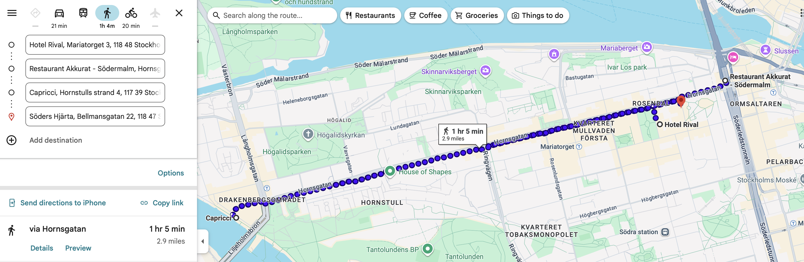
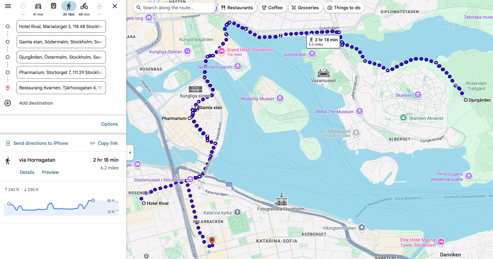
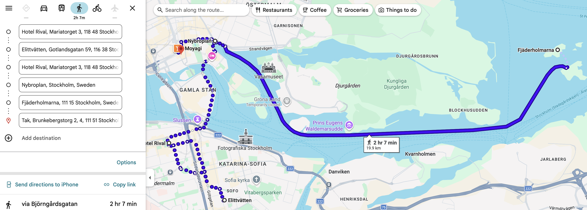

# Stockholm

🇸🇪 **June 16–20 · 4 nights**

🏨 <strong>Hotel Rival</strong> · Södermalm 
Confirmation: <code>35V1GPFJV</code>

---

## Day 6 — Mon Jun 16 · Helsinki → Stockholm { .day-header }

!!! travel "Fly Helsinki → Stockholm"
    **Leave hotel:** ~8:30 AM (train to Helsinki Airport, ~45 min)  
    **Flight:** Finnair AY807, departs 10:10 AM  
    **Arrive:** Stockholm Arlanda ~10:10 AM (1 hr time zone gain)  
    **To hotel:** ~45 min Arlanda Express → walk to Södermalm

!!! do "Afternoon — Explore Södermalm"
    Your base for 4 nights. Stockholm's coolest neighborhood. Drop bags, walk around. Grab lunch at a café on Götgatan.

!!! drink "Evening — Södermalm Bar Hop"
    - **Akkurat** — Legendary. 300+ beers, 300 whiskies, Belgian focus. *Hornsgatan 18*
    - **Capricci** — Pasta + cocktails, beautiful space. Good dinner option. *Bondegatan 48*
    - **Söders Hjärta** — Neighborhood pub, very local. End-of-night vibe.

---

## Day 7 — Tue Jun 17 · Old Town & the Warship { .day-header }

> **NOTES:** 
>  - There is a ferry from Slussen to Djurgården - ~10 minutes
>  - Can walk to the war ship if feeling sporty

!!! do "Morning — Gamla Stan (Old Town)"
    Medieval streets. Skip main souvenir drag, go down tiny side alleys. Find Mårten Trotzigs Gränd (narrowest street, 90 cm wide).

!!! do "Afternoon — Vasa Museum"
    17th-century warship that sank on its maiden voyage, raised 333 years later. One of Scandinavia's best museums. Allow 1.5–2 hours. On Djurgården island.

!!! drink "Evening — Pharmarium"
    Cocktail bar in old pharmacy building, Gamla Stan. Candlelit, atmospheric.
    
    *Stortorget 7*

!!! eat "Dinner — Kvarnen"
    Classic Swedish beer hall since 1908. Hearty food, great atmosphere.
    
    *Tjärhovsgatan 4*

---

## Day 8 — Wed Jun 18 · Laundry, Islands & Rooftops { .day-header }

!!! laundry "Morning — Laundry at Elittvätten"
    Laundry 

    Gotlandsgatan 59, 116 38 Stockholm, Sweden

!!! do "Afternoon — Fjäderholmarna (Archipelago)"
    Public ferry from Nybroplan (25 min). Closest archipelago island — brewery, craft shops, rocky shores. Way better than an organized tour. Ferries run regularly.

!!! drink "Evening — Tak Rooftop"
    Best panoramic views of Stockholm. Arrive before 6 PM for sunset spot. Asian-influenced food and creative cocktails.
    
    *Brunkebergstorg 2*

---

## Day 9 — Thu Jun 19 · Final Day { .day-header }

!!! do "Morning — Fotografiska"
    Photography museum on Södermalm waterfront. Exhibitions rotate but always world-class. Great café on top floor with harbor views.

!!! drink "Evening — Final Stockholm Night"
    - **A Bar Called Gemma** — Creative cocktails, Södermalm. One of Stockholm's best.
    - **Södra Teatern** — Rooftop bar at old theater on Mosebacke. Great sunset views over the water.
